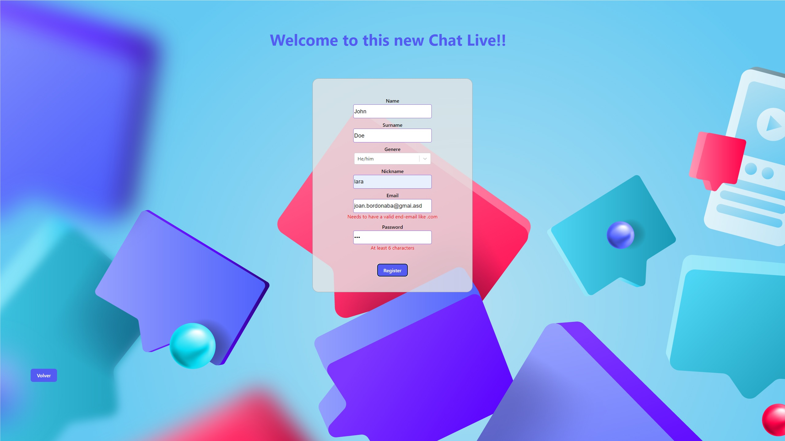
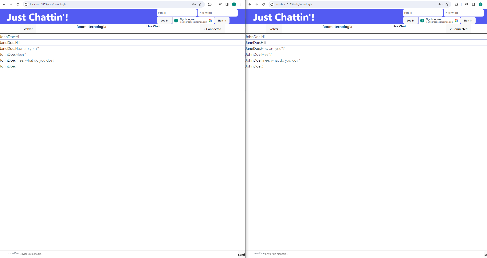
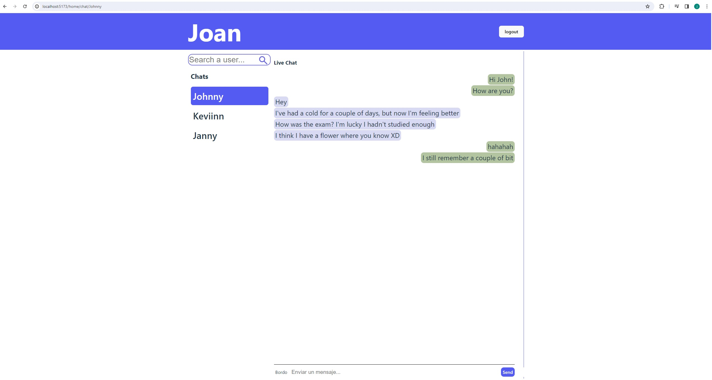

# Just Chattin'

## What can I watch and expect from this project?

This repository has implemented many things, such as:

- Room, namespaces
- Validations JWT
- Sockets
- Component Architecture in Frontend & Hexagonal from Backend as well
- Routing

## Needed Requirements

This project aims to be user-friendly, convenient, and easy to connect to for testing, improvement and more. To handle database queries, we've opted for MongoDB with a [Docker] image, which must be installed first.

## How to Install?

We need to first run our database image from Docker, as it's already configured.

```sh
docker compose up -d
```

To making all installation and run all differents scripts, browse inside subfolders' README.md and follow the instructions

Heading to Server/ README.md to know about it and put this in terminal, <a href='Server'>here</a>

Heading to Client/ README.md to know about it and put this in terminal, <a href='Client'>here</a>

<br/>

When you are logged in, we've added mock users for you. To find them and start chatting, use the keyword search "all".

If want to use this mock users as you, put this data:

- mock-email: `john.doe@gmail.com`/ `jane.doe@gmail.com`/`kevin.doe@gmail.com`/`anne.doe@gmail.com`

- mock-password: `asdasd`

We hope you enjoy this project and feel free to conduct your own tests and make improvements!

<p align="center" >  

</p>

<br/>

<p align="center">  

</p>

<br/>

<p align="center">  

</p>

[Docker]: https://www.docker.com/products/docker-desktop/
